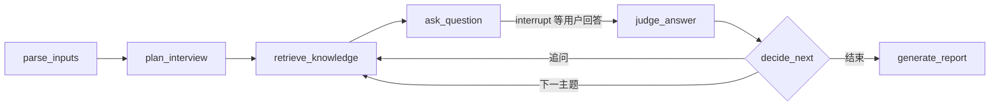

# 面试模拟 Agent 项目规划

## 1. 目标

使用 LangGraph 构建一个面试模拟 Agent：运行时传入简历和岗位 JD，Agent 充当面试官开展完整模拟面试，结合简历、JD 和本地知识库提问并动态追问，面试结束后输出表现评估和优化建议。

## 2. 已确认决策

- 测试阶段使用纯文字、纯命令行一问一答；测试效果好后再加语音。
- 模型统一使用阿里百炼 API：对话模型默认 `qwen-plus`，向量化使用 `text-embedding-v4`。
- 知识库来源是已下载的教师教案，使用前已人工格式化清理为纯知识库，全部为 md 文档且有统一标题层级。
- 面试主题由岗位要求决定，不围绕“教学”本身；知识库只作为专业知识的补充来源。
- 除必要流程控制（会话生命周期、题数上限、追问次数、环节覆盖、状态持久化）由代码完成外，其余内容决策由 Agent 自主决定，代码只做边界否决。
- 简历和 JD 最终支持 md、docx、PDF 三种格式，开发阶段使用 md。

## 3. 整体流程

### 3.1 离线知识库构建

```text
data/kb 的 md 文档
    -> MarkdownHeaderTextSplitter 按标题语义切块
    -> text-embedding-v4 生成向量
    -> 写入本地 Chroma（data/vectorstore）
```

知识库构建与面试运行完全分离，运行阶段知识库不再上传。

### 3.2 在线面试

```text
传入简历 + JD
    -> 结构化解析
    -> 生成面试提纲
    -> 循环：检索知识库 -> 提问 -> 等用户回答 -> 评分 -> 决定下一步
    -> 结束 -> 生成评估报告
```

## 4. LangGraph 设计与节点

核心状态 `InterviewState` 包含：session_id、简历解析结果、JD 解析结果、面试提纲、当前环节、历史消息、当前问题、最近回答、单轮评分、追问次数、题数上限、最终报告。



节点职责：

| 节点 | 职责 |
| --- | --- |
| parse_inputs | 解析并校验简历和 JD，输出结构化对象 |
| plan_interview | 根据 JD 和知识库生成面试提纲 |
| retrieve_knowledge | 按当前环节主题检索知识库 top-k 片段 |
| ask_question | 结合简历、JD、检索片段和最近对话生成问题 |
| judge_answer | 独立评分，输出各维度分数和追问建议 |
| decide_next | 代码边界判断：追问、切主题或结束 |
| generate_report | 聚合单轮评分，调用评估模块生成最终报告 |

## 5. 关键机制

- human-in-the-loop：`ask_question` 后使用 `interrupt()` 暂停图，用户回答通过 `Command(resume=...)` 恢复，配合 `SqliteSaver` 做会话持久化。
- 出题与评分分离：`judge_answer` 使用独立 prompt 和低 temperature，避免自问自答偏乐观。
- 追问策略：单主题最多追问 2 次；追问必须引用用户刚才的回答；Agent 输出结构化决策（如 `follow_up / next_topic / end`），代码条件边做最终校验。
- 边界控制：至少覆盖 JD 核心要求、题数上限、环节覆盖由代码保证，具体问什么由 Agent 自主决定。
- 评估维度：专业准确性、表达结构、岗位匹配度、应变能力等，权重按 JD 动态调整；报告带证据引用和优先级排序的改进建议。

## 6. 项目结构

```text
Mock Interview/
├── pyproject.toml                  # 项目依赖声明：langgraph、dashscope、pypdf、faiss-cpu、pydantic-settings
├── .env.example                    # 环境变量示例：DASHSCOPE_API_KEY、KB_VECTOR_PATH、DB_PATH
├── .gitignore                      # Git 忽略规则
├── README.md                       # 项目说明文档
├── data/                           # 数据目录
│   ├── kb/                         # 已格式化 md 知识库
│   ├── vectorstore/                # Chroma 本地数据，gitignore
│   └── sessions/                   # 面试记录（按 session_id 分文件夹）
│       └── {session_id}/           # 单次面试会话目录
│           ├── raw_history.json    # 完整对话流水
│           └── report.md           # 最终评估报告
├── scripts/                        # 脚本目录
│   ├── ingest_kb.py                # 知识库入库脚本
│   └── run_interview.py            # 面试入口，支持 --resume --jd --session-id
├── src/interview_agent/            # Agent 源码包
│   ├── __init__.py                 # 包入口
│   ├── config.py                   # 使用 pydantic-settings 读取 .env
│   ├── models.py                   # Pydantic 数据结构
│   ├── state.py                    # TypedDict / Pydantic State
│   ├── graph.py                    # 编译后的 app 入口
│   ├── nodes/                      # 图节点集合
│   │   ├── __init__.py             # 节点包入口
│   │   ├── parse_inputs.py         # 输出校验后的 Resume/JD 对象
│   │   ├── plan_interview.py       # 根据 JD 生成提问大纲
│   │   ├── retrieve_knowledge.py   # 检索当前问题相关的 KB 段落
│   │   ├── ask_question.py         # 生成提问文本（含追问逻辑）
│   │   ├── judge_answer.py         # 结合参考答案/知识库评分
│   │   ├── decide_next.py          # 继续追问 or 切换维度 or 结束
│   │   └── generate_report.py      # 调用 evaluation 生成报告
│   ├── llm/                        # LLM 调用层
│   │   ├── __init__.py             # LLM 包入口
│   │   ├── client.py               # 封装 dashscope 调用，支持重试和流式
│   │   └── prompts.py              # 按场景拆分的提示词常量
│   ├── knowledge/                  # 知识库处理层
│   │   ├── __init__.py             # 知识库包入口
│   │   ├── chunker.py              # 采用 MarkdownHeaderTextSplitter 分块
│   │   ├── embedder.py             # 封装 qwen3.7-text-embedding
│   │   ├── retriever.py            # 检索，返回 List[Document]
│   │   └── ingest.py               # 入库主流程
│   ├── storage/                    # 存储层
│   │   ├── __init__.py             # 存储包入口
│   │   ├── checkpoint.py           # 返回 SqliteSaver 实例
│   │   └── session_store.py        # 读写 json 的异步/同步方法
│   └── evaluation/                 # 评估层
│       ├── __init__.py             # 评估包入口
│       ├── rubric.py               # 定义评估维度（完整性/逻辑性/岗位匹配度）
│       └── report_generator.py     # 输出 Markdown/HTML 报告
└── tests/                          # 测试目录
    ├── __init__.py                 # 测试包入口
    ├── conftest.py                 # pytest fixtures（如 mock 百炼 client）
    ├── fixtures/                   # 测试样例
    │   ├── sample_resume.md        # 示例简历
    │   ├── sample_jd.md            # 示例 JD
    │   └── sample_kb/              # 示例知识库
    ├── test_chunker.py             # 分块器测试
    ├── test_retriever.py           # 检索器测试
    ├── test_decide_next.py         # 决策节点测试
    └── test_graph.py               # 单节点 state 变换测试
```

## 7. 环境配置

```env
DASHSCOPE_API_KEY=
KB_PATH=data/kb
KB_VECTOR_PATH=data/vectorstore
DB_PATH=data/sessions/interview.sqlite
INTERVIEWER_MODEL=qwen-plus
JUDGE_MODEL=qwen-plus
EMBEDDING_MODEL=text-embedding-v4
RETRIEVAL_TOP_K=4
MAX_FOLLOW_UPS=2
MAX_QUESTIONS=15
```

## 8. 开发顺序

1. 搭建项目骨架、依赖和配置。
2. 实现离线知识库入库：切块、向量化、写入 Chroma。
3. 实现状态和节点，跑通“出题 -> 回答 -> 评分 -> 追问”主循环。
4. 实现评估报告生成。
5. 补齐测试：切块、检索、边界判断、整图流程。
6. 打磨 CLI 交互，准备真实简历、JD 和知识库做首轮实测。

## 9. 后续待确认事项

- 目标岗位的具体学科和方向。
- 真实简历、JD 的样例内容。
- 知识库规模与入库节奏。
- 语音阶段接入方式（后续再设计）。
- docx/PDF 解析的接入时间点。


第一阶段：替换哑跑节点（graph 每步同步更新路由/边）

1. nodes/plan_interview.py — 调用 llm.plan_interview(jd_text) 产出 outline ，写入 state， stage=planning→asking
2. nodes/parse_inputs.py — 调用 llm.parse_resume + llm.parse_jd ，产出 resume / jd 结构化对象， stage=parsing→planning
3. nodes/retrieve_knowledge.py — 取当前 topic.title/focus 拼 query，调用 retriever.retrieve() ，结果写 retrieval_results
4. nodes/ask_question.py — 据 last_decision.action 分支： next_topic →首问调 llm.ask_question() ； follow_up →调 llm.follow_up() （必须引用上轮回答）； follow_up_count 切题时重置为 0
5. nodes/judge_answer.py — 调 llm.judge(topic, question, answer, retrieval_results) ，维度集合用 normalize_score_items 对齐；只返回 judgments=[item] （增量）不返回全量
6. nodes/decide_next.py — 按优先级判断： question_count>=max_questions →end； follow_up_count>=max_follow_ups →next_topic；其余据 last_judgment.follow_up_suggestion 三选一；更新 current_topic_index / current_topic_id
7. nodes/generate_report.py — 调 llm.generate_report(session_id, judgments) 产出 report ，写入 state， stage=finished
第二阶段：收尾

8. graph.py — 按 1-7 逐步加边： START→parse_inputs→plan→retrieve→ask→[interrupt]→judge→decide ，路由条件： decide.follow_up→retrieve→ask ； decide.next_topic→retrieve→ask ； decide.end→generate_report→END
9. evaluation/report_generator.py — 写一层薄封装：从 session_id 读 load_session() 拿 judgments，调 llm.generate_report() ，返回 InterviewReport （供 CLI 独立跑报告用）
关键约束（每步必做）：

- 节点返回增量（如 judgments=[x] ），不回写全量列表
- 评分维度必须经 normalize_score_items 对齐 4 个固定维度
- 换主题时 follow_up_count 强制置 0
- 每替换 1 个节点，跑一次 test_graph.py + 新增该节点单测